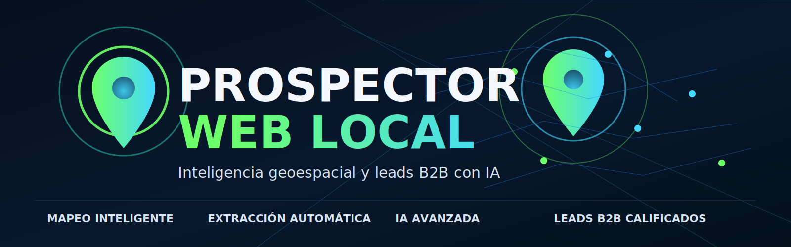
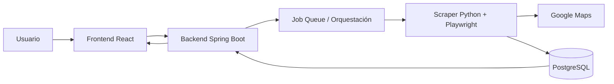
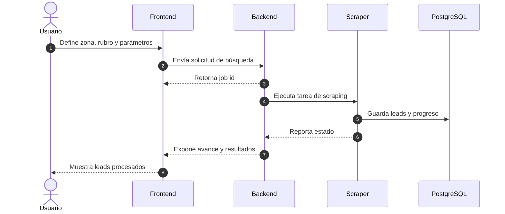
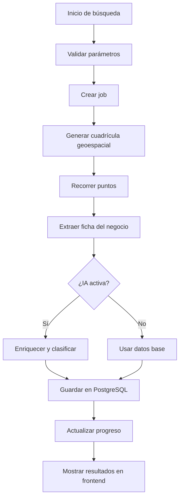

# PROSPECTOR WEB LOCAL

<p align="center">
  
</p>

<p align="center">
  <strong>Inteligencia geoespacial, extracción automática y calificación de leads B2B con IA</strong>
</p>

<p align="center">
  
  
  
  
</p>

## 📌 Resumen

`Prospector Web Local` es una plataforma para mapear negocios locales, extraer leads desde Google Maps y calificarlos con apoyo de IA.

## ✨ Capacidades principales

- 🗺️ Búsqueda geoespacial por radio o cuadrícula.
- 🤖 Extracción automática de datos desde Google Maps.
- 📊 Scoring de leads para priorizar oportunidades.
- 🧠 Asistencia de IA para enriquecer y clasificar prospectos.
- 🗄️ Persistencia estructurada en PostgreSQL.
- 🖥️ Panel web para seguimiento operativo.

## 🧱 Stack

- `backend`: Spring Boot, servicios de negocio y API REST.
- `frontend`: React, interfaz de búsqueda y visualización.
- `scraper`: Python + Playwright para automatización.
- `database`: PostgreSQL para almacenamiento.
- `docs`: capturas, diagramas y documentación.

## 🏗️ Arquitectura



## 🔄 Flujo de trabajo



## 🧭 Componentes del sistema

### Backend

- API principal para crear y consultar búsquedas.
- Orquestación de jobs de scraping.
- Normalización de datos y scoring.

### Frontend

- Panel visual para lanzar búsquedas.
- Vista de resultados y progreso.
- Interacción rápida con el backend.

### Scraper

- Navegación automatizada en Google Maps.
- Extracción de negocio, contacto, ubicación y metadatos.
- Persistencia de resultados por job.

## 🧪 Pipeline de datos



## 📁 Estructura del repo

- `backend/`: API y servicios.
- `frontend/`: cliente web.
- `scraper/`: automatización.
- `docs/`: capturas y documentación.
- `storage/`: datos temporales y jobs.

## 🧰 Requisitos

- Java JDK 17+
- Node.js 18+
- Python 3.10+
- PostgreSQL 14+

## ⚙️ Configuración

1. Crea un archivo `.env` en la raíz.
2. Agrega la variable:

```env
GEMINI_API_KEY=tu_clave_api_de_gemini
```

3. Configura las credenciales de PostgreSQL en `backend/src/main/resources/application.yml`.

## ▶️ Ejecución

### Backend

```powershell
cd backend
& "C:\Users\Alessander\.m2\maven-3.9.6\bin\mvn.cmd" spring-boot:run
```

### Frontend

```powershell
cd frontend
npm install
npm run dev
```

## 🧾 Notas operativas

- La portada del repo está incluida en `docs/cover.svg`.
- Los diagramas Mermaid son simples para maximizar compatibilidad con GitHub.
- El README está pensado para que sirva como entrada visual y técnica del proyecto.

