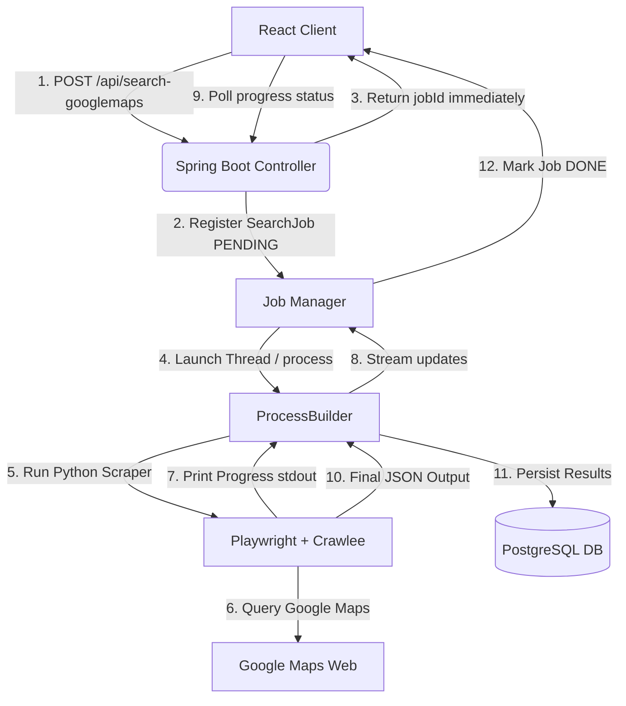

# 🚀 Prospector Web Local — Buscador de Negocios Inteligente

<p align="center">
  
  
  
  
</p>

---

## 📖 Descripción General

**Prospector Web Local** es una herramienta empresarial de prospección geográfica a costo $0. Permite escanear áreas geográficas específicas mediante un algoritmo de **cuadrícula densa** sobre Google Maps para identificar negocios locales, extraer su información de contacto (teléfono, sitio web, redes sociales) y calificarlos según su necesidad de desarrollo web.

---

## ✨ Características Principales

*   🗺️ **Barrido en Cuadrícula Dinámica con Filtro Circular**: Genera coordenadas de búsqueda separadas geográficamente usando la fórmula de *Haversine*, omitiendo puntos de las esquinas fuera del radio para evitar peticiones redundantes.
*   🎯 **Espaciado Quirúrgico & Solapamiento del 15%**: En modo Completa, calcula el espaciado matemático para situar las celdas a **menos de 100 metros** una de otra, asegurando una cobertura total.
*   📡 **GPS Spoofing y Evasión de Bloqueos**: Simula coordenadas geográficas por hardware en el contexto del navegador para anular redirecciones por geolocalización de IP, simulando actividad humana real con retrasos aleatorios (`2s - 6s`).
*   🔍 **Triple/Cuádruple Zoom de Calle (15z - 18z)**: Recorre de forma secuencial múltiples zooms de gran detalle para listar pequeños negocios de barrio omitidos en zooms lejanos.
*   📂 **Búsqueda por Sectores con Aliases**: Integra un diccionario de alias que expande un término comercial (ej. *veterinaria*) en múltiples queries aliadas (*grooming, clínica veterinaria, pet shop*) en modo completo.
*   ✍️ **Búsqueda Libre Normalizada**: Permite buscar términos libres usando un normalizador Unicode que limpia acentos, dobles espacios y traduce singulares a plurales automáticamente para enganchar alias.
*   📊 **Interfaz Map-Céntrica Profesional**: El mapa ocupa el 100% del lienzo. Los controles flotan en un panel colapsable (`◀` / `⚙️`) y los resultados se despliegan en una **Bottom Sheet deslizable** interactiva.
*   💻 **Holographic Progress Modal**: Presenta el progreso de la cuadrícula con un radar giratorio animado, contador digital iluminado y una consola de comandos en tiempo real.

---

## 🛠️ Arquitectura del Sistema

El flujo de procesamiento asíncrono está diseñado para liberar la conexión HTTP al instante y delegar el proceso pesado a hilos secundarios:



---

## 📂 Estructura del Proyecto

*   `frontend/`: Código fuente de la interfaz de usuario en React, TypeScript y CSS.
*   `backend/`: Microservicio en Java Spring Boot que administra los Jobs de búsqueda en memoria y persiste los Leads.
*   `scraper/`: Script de automatización en Python que ejecuta el PlaywrightCrawler con Crawlee.

---

## ⚙️ Guía de Instalación y Configuración

### Prerrequisitos
*   **Java 21 o superior** (Java 25 recomendado)
*   **Node.js 18 o superior**
*   **Python 3.10 o superior**
*   **PostgreSQL 14 o superior**

### 1. Base de Datos
Crea una base de datos en PostgreSQL llamada `prospector` e importa la estructura.
Asegúrate de que la URL de conexión en `backend/src/main/resources/application.yml` incluya el parámetro para evitar mismatch de tipos JSONB:
```yaml
url: jdbc:postgresql://localhost:5432/prospector?stringtype=unspecified
```

### 2. Configuración del Scraper (Python)
Entra a la carpeta del scraper, instala las dependencias y Playwright:
```bash
cd scraper
pip install -r requirements.txt
playwright install chromium
```

### 3. Servidor Backend (Spring Boot)
Compila y ejecuta el backend con Maven:
```bash
cd backend
mvn spring-boot:run
```
El servidor levantará en [http://localhost:8080](http://localhost:8080).

### 4. Servidor Frontend (React)
Instala las dependencias y levanta el servidor de desarrollo:
```bash
cd frontend
npm install
npm run dev
```
La aplicación web se abrirá en [http://localhost:3000](http://localhost:3000).

---

## 📝 Licencia

Este proyecto está diseñado para uso comercial privado y prospección interna local. Desarrollado con tecnología de punta a costo cero.
